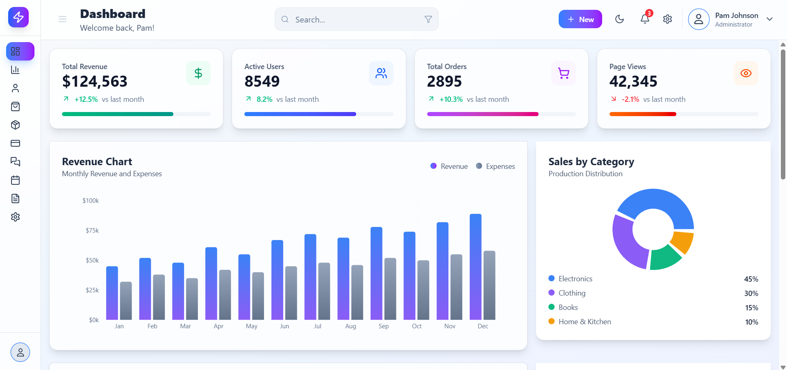
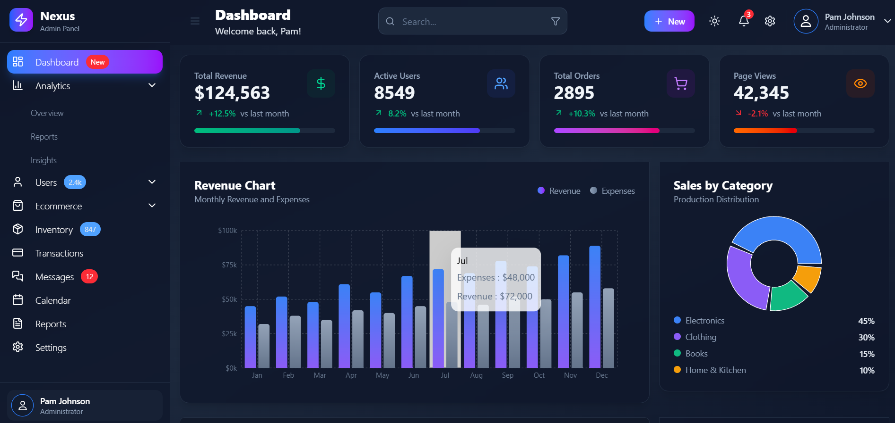

# 🧑‍💼 React Admin Dashboard

A modern, responsive, and theme-aware Admin Dashboard built using **React**, **Tailwind CSS**, and **Lucide React** icons. It displays recent orders, top product performance, and dynamic styling for statuses and trends.

## 🚀 Features

- 📊 Interactive Charts & Graphs (Recharts) 
- 🌗 Light & Dark mode support using Tailwind's `dark` class  
- 📊 Dashboard sections:
  - Recent Orders table with dynamic status badges
  - Top Products panel with sales, revenue, and trend indicators
- 🎨 Clean UI with modern gradients, hover effects, and utility-first styling
- 🔧 Easily extendable and component-based structure

## 🛠️ Tech Stack

- **React**
- **Tailwind CSS**
- **Lucide React** for icons
- **Recharts** – For graphs and charting
- **Vite** 

<h3 align="center">Dashboard Preview</h3>

<table>
  <tr>
    <td align="center">
      <strong>Light Mode</strong> 
      
    </td>
    <td align="center">
      <strong>Dark Mode</strong> 
      
    </td>
  </tr>
</table>

## 🧠 Learnings

- Learned how to build fully responsive layouts using **Tailwind CSS** utility classes.
- Integrated dynamic and real-time data visualizations using **Recharts**.
- Implemented global **dark/light theme switching** and managed UI state efficiently.
